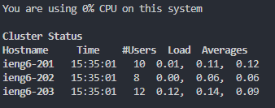
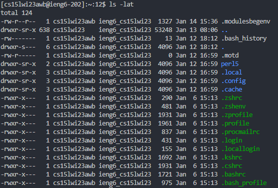
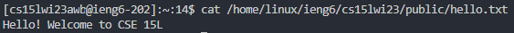

## Installing VScode
* Go to [https://code.visualstudio.com/](https://code.visualstudio.com/) and download the version for your operating system
* After downloading it, follow the instructions for setup and you should be at a start window that looks like this:

  

## Remotely Connecting
* Before using git, if you are on windows you first need to install it from this link: [https://gitforwindows.org/](https://gitforwindows.org/)
* Open the terminal in VScode by using Ctrl or Command + `
* Get your course-specific account name from putting your student login into [https://sdacs.ucsd.edu/~icc/index.php](https://sdacs.ucsd.edu/~icc/index.php)
* If you need to change your activate your account, then click on the button starting with cs15 then press `change your password`
* Make sure the terminal is set to bash then type `ssh cs15lwi23zz@ieng6.ucsd.edu`, replacing the zz with the letters in your course account name
* Enter yes if you get any messages asking about authenticity then when you get to the Password, type in your password and you should get a message that begins with 'Now on remote server' followed by information that looks like this:

  

## Trying Some Commands
* You can now run commands in the terminal such as `cd`, `ls`, and `cat`
* 'ls -a' for example outputs lists and columns of account names starting with cs15lwi23, I think these are the users that have connected to the server
* If I plug in `ls /home/linux/ieng6/cs15lwi23/cs15lwi23zz`, replacing zz with one of the account names printed I get `ls: cannot open directory /home/linux/ieng6/cs15lwi23/cs15lwi23zz: Permission denied`
* `ls -lat` should produce an output like this:
 
  
* `cat /home/linux/ieng6/cs15lwi23/public/hello.txt` produces the welcome text:

  

* Based on this, I'm guessing `cat` prints the text contained in a file
