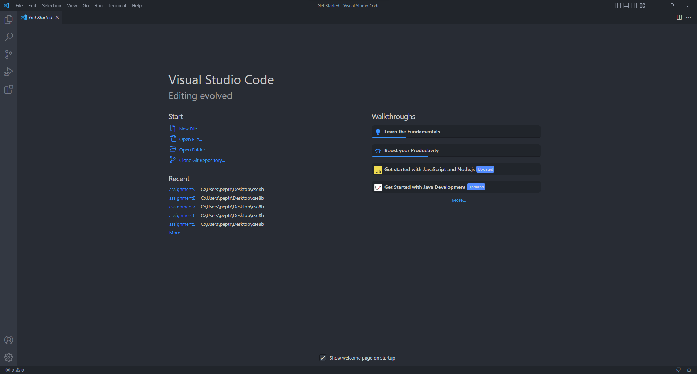

**Installing VScode**
* Go to https://code.visualstudio.com/ and download the version for your operating system
* After downloading it, follow the instructions for setup and you should be at a start window that looks like this:

**Remotely Connecting**
* Before using git, if you are on windows you first need to install it from this link: https://gitforwindows.org/
* Open the terminal in VScode by using Ctrl or Command + `
* Make sure the terminal is set to bash then type **ssh cs15lwi23zz@ieng6.ucsd.edu**, replacing the zz with the letters in your course account name
* Enter yes if you get any messages asking about authenticity then when you get to the Password, type in your password and you should get a message that begins with **# Now on remote server** followed by information that looks like this:

**Trying Some Commands**
