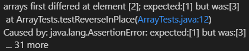

## Part 1
* This is the code for the `StringServer`:

  
  
* These are tests of `/add message`:

  
  
  * Here, the `handleRequest(URI url)` method is called
  * In this case, the argument is `http://localhost:4001/add-message?s=testing1`
  * When the string is split from the `"="`, urlSplit[0] is `http://localhost:4001/add-message?s`
  * urlSplit[1] is `testing1`
  * `testing1` is then added to the next line of `fullString`
  * The url value changes because the string ends with `testing1` after the `"="`
  * This results in a different urlSplit[1] because it corresponds to the ending of the url
  * fullString also changes as `testing1` is added to the end of it before fullString is returned
  
  
  
  * Here, the `handleRequest(URI url)` method is called
  * In this case, the argument is `http://localhost:4001/add-message?s=how are you`
  * When the string is split from the `"="`, urlSplit[0] is `http://localhost:4001/add-message?s`
  * urlSplit[1] is `how are you`
  * `how are you` is then added to the next line of `fullString`
  * The url value changes because the string ends with `how are you` after the `"="`
  * This results in a different urlSplit[1] because it corresponds to the ending of the url
  * fullString also changes as `how are you` is added to the end of it before fullString is returned

## Part 2
  * A failure inducing input for ArrayTests.java is {1, 2, 3}:
  `@Test 
	public void testReverseInPlace() {
    int[] input1 = { 3 };
    int [] input2 = {1, 2, 3};
    ArrayExamples.reverseInPlace(input1);
    ArrayExamples.reverseInPlace(input2);
    assertArrayEquals(new int[]{ 3 }, input1);
    assertArrayEquals(new int[]{3, 2, 1}, input2);
	}`
  * An input that doesn't produce a failure for ArrayTests.java is {3}:
  `	@Test 
	public void testReverseInPlace() {
    int[] input1 = { 3 };
    ArrayExamples.reverseInPlace(input1);
    ArrayExamples.reverseInPlace(input2);
    assertArrayEquals(new int[]{ 3 }, input1);
	}
  * The symptom as the output of running the tests:
  
  
  
## Part 3 
  * Something I learned from 
  
