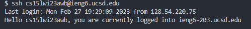
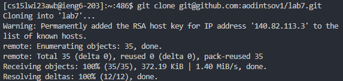
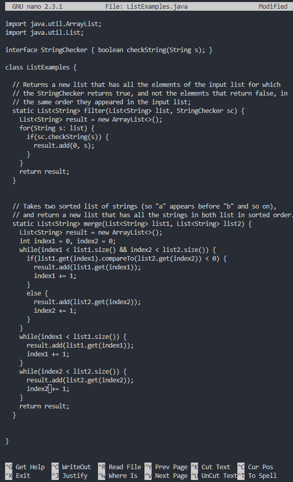

# Lab Report 4

Commands run beforehand:
* `ssh cs15lwi23awb@ieng6.ucsd.edu`
* `javac -cp .:lib/hamcrest-core-1.3.jar:lib/junit-4.13.2.jar *.java`
* `java -cp .:lib/hamcrest-core-1.3.jar:lib/junit-4.13.2.jar org.junit.runner.JUnitCore ListExamplesTests.java`
* `logout`
## 4. Log into ieng6

* Keys pressed: `<up><enter>`
* Using the up key, you can go to your previously entered commands so pressing this goes to the previously entered command, `ssh cs15lwi23awb@ieng6.ucsd.edu`
* `ssh cs15lwi23awb@ieng6.ucsd.edu` is the command that logs me into my ucsd account

  
## 5. Clone your fork of the repository from your Github account

* I went to the fork of my repository then went to Code > SSH > Copy Button
* Then, in the terminal I typed `git clone` + `<Ctrl-V><Enter>`
* `git clone` cloned the fork of the repository to the server in a lab7 folder
* `Ctrl-V` pastes copied text
  
  
## 6. Run the tests, demonstrating that they fail
  
* To go into the lab7 directory, I typed in `cd lab7`, which changed the directory to the lab7 folder
* <up><up><up><up><up>
* <up><up><up><up><up>
  
## 7. Edit the code file to fix the failing test
  
## 8. Run the tests, demonstrating that they now succeed

## 9. Commit and push the resulting change to your Github account
