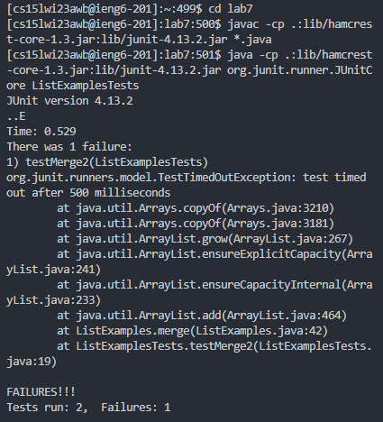

# Lab Report 4

Commands run beforehand:
* `ssh cs15lwi23awb@ieng6.ucsd.edu`
* `javac -cp .:lib/hamcrest-core-1.3.jar:lib/junit-4.13.2.jar *.java`
* `java -cp .:lib/hamcrest-core-1.3.jar:lib/junit-4.13.2.jar org.junit.runner.JUnitCore ListExamplesTests`
* `logout`
## 4. Log into ieng6

* Keys pressed: `<up><enter>`
* Using the up key, you can go to your previously entered commands so pressing this goes to the previously entered command, `ssh cs15lwi23awb@ieng6.ucsd.edu`
* `ssh cs15lwi23awb@ieng6.ucsd.edu` is the command that logs me into my ucsd account

  
## 5. Clone your fork of the repository from your Github account

* I went to the fork of my repository then went to Code > SSH > Copy Button
* Then, in the terminal I typed `git clone` + `<Ctrl-V><Enter>`
* `git clone` cloned the fork of the repository to the server in a lab7 folder
* `Ctrl-V` pastes copied text
  
  
## 6. Run the tests, demonstrating that they fail
  
* To go into the lab7 directory, I typed in `cd lab7`, which changed the directory to the lab7 folder
* Keys pressed `<up><up><up><up><up><enter>`
* This went up to the previously entered command, `javac -cp .:lib/hamcrest-core-1.3.jar:lib/junit-4.13.2.jar *.java`, to compile the .java files in the directory because `*.java` makes the command apply to all the files ending in `.java`
* Keys pressed `<up><up><up><up><up><enter>`
* This then went to the previous command, `java -cp .:lib/hamcrest-core-1.3.jar:lib/junit-4.13.2.jar org.junit.runner.JUnitCore ListExamplesTests`, to run the ListExamplesTests file
* You should get a message saying that a test failed

  
## 7. Edit the code file to fix the failing test

* To open the ListExamples file in nano, enter `nano ListExamples.java`
* To skip to line 43, column 13 you first use the `Ctrl+Shift+ "- key"` combination to get the prompt asking for the line and column number
* You then type `43,13`, hit `enter` and you are at line 43, column 13
* I then did `<Backspace><2>` to correct the mistake, changing Index1 to Index2
* The next keystrokes were `<Ctrl-X>`, which exited the file, `<Y>`, which confirmed the changes, and `<enter>`, to confirm the file name staying the same

  
## 8. Run the tests, demonstrating that they now succeed

* Keys pressed `<up><up><up><enter>`
* This went up to the previously entered command, `javac -cp .:lib/hamcrest-core-1.3.jar:lib/junit-4.13.2.jar *.java`, to compile the .java files in the directory because `*.java` makes the command apply to all the files ending in `.java`
* Keys pressed `<up><up><up><enter>`
* This then went to the previous command, `java -cp .:lib/hamcrest-core-1.3.jar:lib/junit-4.13.2.jar org.junit.runner.JUnitCore ListExamplesTests`, to run the ListExamplesTests file
* This time, you should get a message saying that the tests run OK

  
## 9. Commit and push the resulting change to your Github account

* Enter `git add ListExamples.java` which tells git to include the file in the update
* Then enter `git commit -m "new"` which tells git to store the changes in your git directory
* Finally, enter `git push` to push the changes to the remote directory

  
