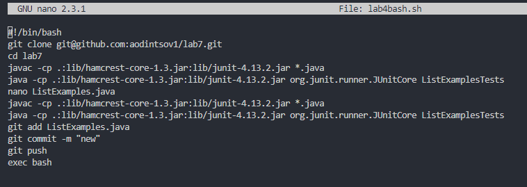
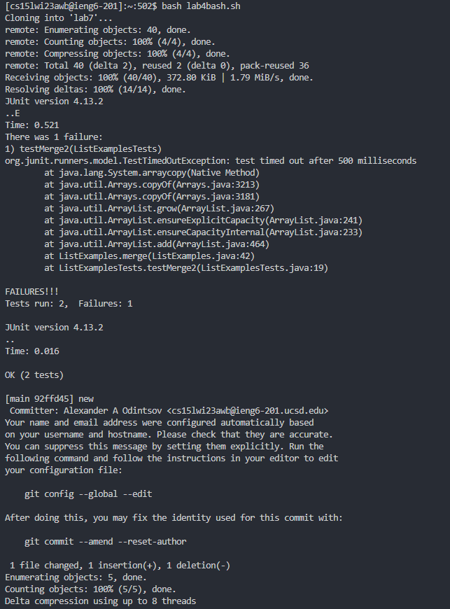
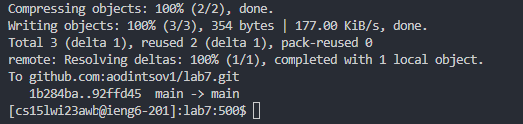

# Lab Report 5

## Lab report 4 update

* A faster way of doing lab report 4, even though it was against the rules, is to use a bash script
* The bash script makes things much faster as it does not require input from the user outside of nano where you need to edit the file, automating most of the steps
* I created a bash script with the `nano lab4bash.sh` command, which also opens the file
* The first line is `#!/bin/bash` as it begins the script and specifies that it is using the bash interpreter
* Then, I copied over the commands that I described using in Lab Report 4 in order, ignoring the steps where user input is required to change the file
* The bash file ends with `exec bash` as that command executs the script
* Screenshot of `lab4bash.sh`:

  

* I then exit the bash script using `<Ctrl-X>` to quit the file, `<Y>` to confirm saving the file, and `<enter>` to confirm the file name
* To run the file, I use `bash lab4bash.sh`
* `lab4bash.sh` being run:

  
  

* You can see the tests failing at first then succeeding later on in the script, as expected
